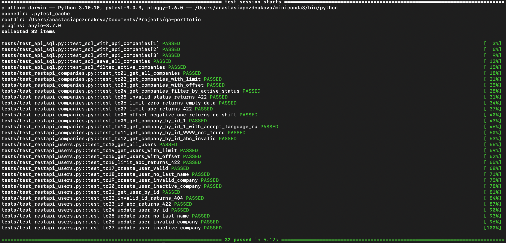

# QA — Backend Autotests

[](https://python.org)
[](LICENSE)
[](https://pytest.org)

Портфолио с автотестами для тестирования REST API (restapi.tech).  
Тесты написаны на pytest + requests, коллекция Postman прилагается.

---

## 🔧 Технологии

- **Python 3.10+** — основной язык программирования
- **pytest** — фреймворк для написания и запуска тестов
- **requests** — библиотека для выполнения HTTP‑запросов
- **Postman** — инструмент для ручного и автоматизированного тестирования API
- **SQLite** — планируется (проверка данных через БД)
- **GitHub** — платформа для хранения портфолио

---

## 🗂 Структура проекта

| Путь | Описание |
|------|----------|
| `tests/test_restapi_companies.py` | pytest автотесты для `/companies` |
| `postman/restapi-tech-collection.json` | Postman коллекция |
| `test-cases/GET_companies.md` | Тест-кейсы для `/companies` |
| `assets/pytest_results.png` | Скриншот результатов |
| `.gitignore` | Исключённые файлы |
| `LICENSE` | Лицензия MIT |
| `README.md` | Документация |

---

## 🚀 Запуск автотестов (pytest)

### 1. Установка зависимостей:

```bash
pip install pytest requests
```

### 2. Запуск всех тестов:

```bash
pytest tests/ -v
```

### 3. Запуск одного теста:

```bash
pytest tests/test_restapi_companies.py::test_tc01_get_all_companies -v
```

### 4. Запуск с подробным выводом и показом результатов для пройденных тестов:

```bash
pytest tests/ -v -s
```

### 5. Запуск тестов с генерацией отчёта в формате HTML:

```bash
pytest tests/ --html=report.html
```

---

## 📮 Postman коллекция

Как импортировать и настроить:

1. Откройте Postman.

2. Нажмите Import → выберите файл postman/restapi-tech-collection.json.

3. Создайте окружение (Environment) с переменной:
BASE_URL = https://restapi.tech/api

4. Запустите запросы и проверьте результаты тестов во вкладке Test Results.

Что содержит коллекция:

1. Запросы к эндпоинтам API.

2. Автоматизированные проверки на JavaScript.

---

## 🧪 Покрытие тестами

### GET /api/companies

| TC | Проверка | Ожидаемый статус | Статус |
|----|----------|------------------|--------|
| TC-01 | Базовый GET (структура, поля) | 200 | ✅ готов |
| TC-02 | Параметр `limit=5` | 200 | ✅ готов |
| TC-03 | Пагинация `offset=2` | 200 | ✅ готов |
| TC-04 | Фильтрация `status=ACTIVE` | 200 | ✅ готов |
| TC-05 | Невалидный `status=INVALID` | 422 | ✅ готов |
| TC-06 | Граничный `limit=0` | 200 | ✅ готов |
| TC-07 | Невалидный `limit=abc` | 422 | ✅ готов |
| TC-08 | Граничный `offset=-1` | 200 | ✅ готов |

### GET /api/companies

| TC | Проверка | Ожидаемый статус | Статус |
|----|----------|------------------|--------|
| TC-01 | Получение компании id=1 (без Accept-Language) | 200 | ✅ готов |
| TC-02 | Получение компании с заголовком Accept-Language: RU | 200 | ✅ готов |
| TC-03 | Несуществующий id=9999 | 404 | ✅ готов |
| TC-04 | Невалидный id=abc | 422 | ✅ готов |

---

### 🔜 В планах

| Эндпоинт | Методы | Что планируется | Статус |
|----------|--------|-----------------|--------|
| `/users` | GET, POST, PUT, DELETE | CRUD-тесты | 📋 планируется |
| `/auth` | POST, GET | Авторизация, получение токена | 📋 планируется |
| SQL | — | Проверка данных через SQLite | 📋 планируется |

---

## 📸 Результаты тестов



---

## 📋 Примечания

1. Перед запуском тестов убедитесь, что API доступно по указанному BASE_URL.

2. Для Postman тестов проверьте актуальность переменных окружения.

3. При изменении эндпоинтов обновите соответствующие тест‑кейсы в test-cases/.

---

## 📄 Лицензия

Проект распространяется под лицензией MIT.

---

## 🔗 Ссылка на портфолио

https://github.com/Anastasia-Pozdnyakova/qa-portfolio

---

📫 **Контакты:** GitHub [Anastasia-Pozdnyakova](https://github.com/Anastasia-Pozdnyakova) · Telegram [@poznast](https://t.me/@poznast) · Email poznast59@ya.ru