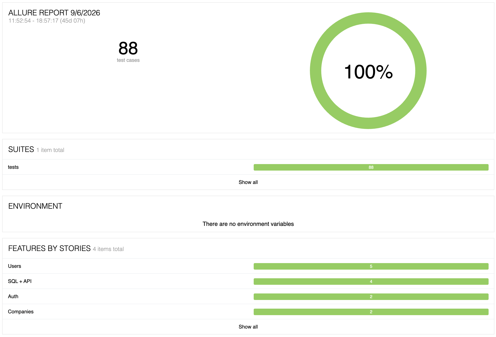

# QA — Backend Autotests

[](https://python.org)
[](LICENSE)
[](https://pytest.org)

Портфолио с автотестами для тестирования REST API (restapi.tech).  
Тесты написаны на pytest + requests, коллекция Postman прилагается.

---

## 🔧 Технологии

- **Python 3.10+** — основной язык программирования
- **pytest** — фреймворк для написания и запуска тестов
- **requests** — библиотека для выполнения HTTP‑запросов
- **Postman** — инструмент для ручного и автоматизированного тестирования API
- **SQLite** — проверка данных через БД
- **GitHub** — платформа для хранения портфолио

---

## 🗂 Структура проекта

| Путь | Описание |
|------|----------|
| `tests/test_restapi_companies.py` | pytest автотесты для `/companies` |
| `tests/test_restapi_users.py` | pytest автотесты для `/users` |
| `tests/test_restapi_auth.py` | pytest автотесты для `/auth` |
| `tests/test_api_sql.py` | тесты интеграции API + SQLite |
| `api/companies_api.py` | API-клиент для `/companies` |
| `api/users_api.py` | API-клиент для `/users` |
| `api/auth_api.py` | API-клиент для `/auth` |
| `data/companies_data.py` | Тестовые данные для `/companies` |
| `data/users_data.py` | Тестовые данные для `/users` |
| `data/auth_data.py` | Тестовые данные для `/auth` |
| `data/expected_status.py` | Ожидаемые статусы ответов |
| `utils/helpers.py` | Вспомогательные функции |
| `postman/restapi-tech-collection.json` | Postman коллекция |
| `test-cases/companies.md` | Тест-кейсы для `/companies` |
| `test-cases/users.md` | Тест-кейсы для `/users` |
| `test-cases/auth.md` | Тест-кейсы для `/auth` |
| `assets/pytest_results.png` | Скриншот результатов |
| `.gitignore` | Исключённые файлы |
| `LICENSE` | Лицензия MIT |
| `README.md` | Документация |

---

## 🚀 Запуск автотестов (pytest)

### 1. Установка зависимостей:

```bash
pip install pytest requests
```

### 2. Запуск всех тестов:

```bash
pytest tests/ -v
```

### 3. Запуск одного теста:

```bash
pytest tests/test_restapi_companies.py::test_tc01_get_all_companies -v
```

### 4. Запуск с подробным выводом и показом результатов для пройденных тестов:

```bash
pytest tests/ -v -s
```

### 5. Запуск тестов с генерацией отчёта в формате HTML:

```bash
pytest tests/ --html=report.html
```

### 6. Запуск Postman коллекции через Newman

```bash
newman run postman/restapi-tech-collection.json --environment postman/restapi-tech-environment.json
```
---

## 🚀 Запуск Postman коллекции через Newman

### 1. Установка Newman:

```bash
npm install -g newman
```

### 2. Запуск коллекции через Newman:

```bash
newman run postman/restapi-tech-collection.json --environment postman/restapi-tech-environment.json
```

---

## 🚀 Генерация отчёта Allure

### 1. Установка Allure:

```bash
brew install allure
```

### 2. Запуск тестов с Allure:

```bash
pytest tests/ --alluredir=allure-results
```

### 3. Сгенерировать отчёт:

```bash
allure generate allure-results -o allure-report --clean
```

### 4. Открыть отчёт:

```bash
allure open allure-report
```

---

## 📮 Postman коллекция

Как импортировать и настроить:

1. Откройте Postman.

2. Нажмите Import → выберите файл postman/restapi-tech-collection.json.

3. Создайте окружение (Environment) с переменной:
BASE_URL = https://restapi.tech/api

4. Запустите запросы и проверьте результаты тестов во вкладке Test Results.

Что содержит коллекция:

1. Запросы к эндпоинтам API.

2. Автоматизированные проверки на JavaScript.

---

## 🧪 Покрытие тестами

### /api/companies и /{id}

| TC | Проверка | Статус |
|----|----------|--------|
| TC-01 | Базовый GET (структура, поля) | ✅ |
| TC-02, TC-06, TC-07 | Параметризованные тесты для `limit` (5, 0, "abc") | ✅ |
| TC-03, TC-08 | Параметризованные тесты для `offset` (2, -1) | ✅ |
| TC-04, TC-05 | Параметризованные тесты для `status` (ACTIVE, INVALID) | ✅ |
| TC-09 | Получение компании по ID (без Accept-Language) | ✅ |
| TC-10 | Получение компании с заголовком Accept-Language: RU | ✅ |
| TC-11 | Несуществующий ID (9999) | ✅ |
| TC-12 | Невалидный ID (abc) | ✅ |

### /api/users

| TC | Проверка | Статус |
|----|----------|--------|
| TC-13 | Базовый GET /users (структура, поля) | ✅ |
| TC-14, TC-16 | Параметризованные тесты для `limit` (5, "abc") | ✅ |
| TC-15 | Параметр `offset=2` | ✅ |
| TC-17 | Создание пользователя (201) | ✅ |
| TC-18, TC-19, TC-20 | Негативные сценарии POST (422, 404, 400) | ✅ |
| TC-21 | GET /users/{id} (200) | ✅ |
| TC-22, TC-23 | Параметризованные тесты для невалидного ID (404, 422) | ✅ |
| TC-24 | PUT /users/{id} (200) | ✅ |
| TC-25, TC-26, TC-27 | Негативные сценарии PUT (422, 404, 400) | ✅ |
| TC-28 | DELETE /users/{id} (202) | ✅ |
| TC-29, TC-31 | Параметризованные тесты для DELETE с невалидным ID (404, 422) | ✅ |
| TC-30 | Повторное удаление (404) | ✅ |

### 🔐 Auth

| TC | Проверка | Статус |
|----|----------|--------|
| TC-32 | Успешная авторизация | ✅ |
| TC-33 | Невалидный пароль (403) | ✅ |
| TC-34 | Короткий логин < 3 символов (422) | ✅ |
| TC-35 | Без поля `password` (422) | ✅ |
| TC-36 | /me с валидным токеном (200) | ✅ |
| TC-37 | /me без заголовка `x-token` (401) | ✅ |
| TC-38 | /me с невалидным токеном (403) | ✅ |
| TC-39 | Истечение токена (403) | ✅ |

### 🗄️ SQL + API интеграция

| Тест | Проверка | Статус |
|------|----------|--------|
| `test_sql_with_api_companies` | Сохранение одной компании в БД | ✅ готов |
| `test_sql_save_all_companies` | Сохранение всех компаний в БД | ✅ готов |
| `test_sql_filter_active_companies` | Фильтрация по статусу в SQL | ✅ готов |

---

## 📸 Результаты тестов


---

## 📊 Allure-отчёт



---

## 📋 Примечания

1. Перед запуском тестов убедитесь, что API доступно по указанному BASE_URL.

2. Для Postman тестов проверьте актуальность переменных окружения.

3. При изменении эндпоинтов обновите соответствующие тест‑кейсы в test-cases/.

---

## 📄 Лицензия

Проект распространяется под лицензией MIT.

---

## 🔗 Ссылка на портфолио

https://github.com/Anastasia-Pozdnyakova/qa-portfolio

---

📫 **Контакты:** GitHub [Anastasia-Pozdnyakova](https://github.com/Anastasia-Pozdnyakova) · Telegram [@nastyapoze](https://t.me/@nastyapoze) · Email poznast59@ya.ru